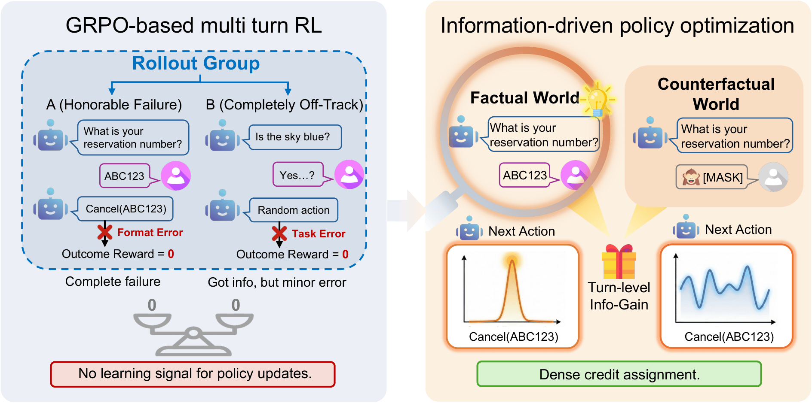
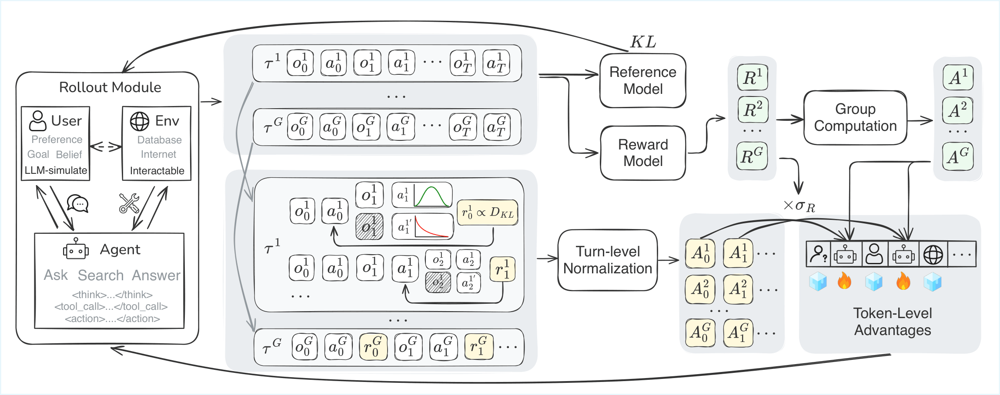

<div align="center">

# InfoPO: Information-Driven Policy Optimization for User-Centric Agents

[](https://arxiv.org/abs/2502.xxxxx)
[](LICENSE.txt)
[](https://www.python.org/downloads/)

</div>

This repository is the official implementation of **InfoPO**, an information-driven reinforcement learning algorithm for training user-centric agents in multi-turn interactive scenarios.

<p align="center">
  
</p>

**InfoPO addresses the sparse reward problem in multi-turn agent training.** Traditional GRPO-based methods fail to distinguish between "honorable failures" (correct information gathering, minor execution error) and "complete failures" (entirely off-track behavior) when both receive zero outcome reward. InfoPO introduces turn-level information gain through counterfactual reasoning, providing dense credit assignment for more effective learning.

## Overview

InfoPO enhances standard RL training by introducing **intrinsic rewards** that measure information gain through counterfactual reasoning. Instead of relying solely on sparse terminal rewards, InfoPO quantifies how observations shift the agent's decision-making, providing dense learning signals for efficient exploration.

**Key Features:**
- **Turn-Level Information Gain**: Measures how observations influence subsequent actions via KL divergence
- **Counterfactual Reasoning**: Compares policy distributions with and without observations
- **Adaptive Reward Fusion**: Combines intrinsic and outcome rewards with variance-gated weighting
- **Multi-Turn Credit Assignment**: Proper attribution across extended conversations

## Method

<p align="center">
  
</p>

InfoPO computes turn-level information gain as:

```
I_t = KL(P(action_{t+1} | context, observation_t) || P(action_{t+1} | context, placeholder))
```

This measures how much the observation at turn `t` shifts the agent's action distribution at turn `t+1`, providing a task-agnostic signal for exploration.

## Quick Start

### Prerequisites

- Python 3.12
- CUDA-compatible GPU(s)
- OpenAI API key (for user simulation)

### Installation

1. **Create Environment**
   ```bash
   conda create -n infopo python=3.12
   conda activate infopo
   ```

2. **Install Dependencies**
   ```bash
   pip install -e .[sglang]
   pip install flash-attn --no-build-isolation
   ```

3. **Install Gym Environments**
   ```bash
   bash install_gyms.sh
   ```

### Training with InfoPO

1. **Configure Environment Variables**
   ```bash
   export CUDA_VISIBLE_DEVICES=0,1,2,3
   export OPENAI_API_KEY="your-openai-key"
   export OPENAI_BASE_URL="https://api.openai.com/v1"
   export MULTITURN_MODEL_NAME="gpt-4o"
   ```

2. **Update Training Script**
   
   Edit `examples/sglang_multiturn/train.sh`:
   ```bash
   PROJECT_DIR="/path/to/your/project"
   MODEL_PATH="/path/to/your/model"
   ```

3. **Start Training**
   ```bash
   bash ./examples/sglang_multiturn/train.sh
   ```

The training script uses InfoPO by default with:
- `algorithm.adv_estimator=info_grpo`
- `algorithm.use_intrinsic_reward=True`

## Configuration

### Key Hyperparameters

```yaml
algorithm:
  adv_estimator: info_grpo
  use_intrinsic_reward: True
  gamma: 0.8
  
intrinsic_reward:
  intrinsic_weight: 0.5          # Weight for intrinsic rewards (β_0)
  normalize_intrinsic: True      # Normalize with GRPO group baseline
  intrinsic_kl_batch_size: 4     # Batch size for KL computation
  observation_placeholder: "No information found."
```

### Training Examples

**Multi-Turn User Benchmarks:**
```bash
bash examples/sglang_multiturn/train.sh
```

**Tau2 Benchmarks:**
```bash
bash examples/tau2/train.sh
```

**ColBench:**
```bash
bash examples/colbench/train.sh
```

## How It Works

1. **Rollout Phase**: Agent interacts with environments, generating multi-turn conversations
2. **Intrinsic Reward Computation**: For each turn with observation:
   - Compute KL divergence between policies with/without observation
   - Assign information gain as intrinsic reward to the action that produced the observation
3. **Advantage Estimation**: Combine intrinsic and outcome rewards with adaptive weighting
4. **Policy Update**: Optimize policy using InfoPO objective with variance-gated advantages

## Monitoring

Training progress is logged via:
- **Console Output**: Real-time metrics
- **Weights & Biases**: Detailed visualizations and metrics
- **Checkpoints**: Automatic model saving

## Citation

If you find this work useful, please cite our paper:

```bibtex
@article{infopo2025,
  title={InfoPO: Information-Driven Policy Optimization for User-Centric Agents},
  author={},
  journal={arXiv preprint arXiv:2502.xxxxx},
  year={2025}
}
```

## Acknowledgements

This codebase is built upon [UserRL](https://github.com/SalesforceAIResearch/UserRL). We thank the authors for their excellent work.

## License

This project is licensed under the Apache 2.0 License - see the [LICENSE](LICENSE.txt) file for details.
